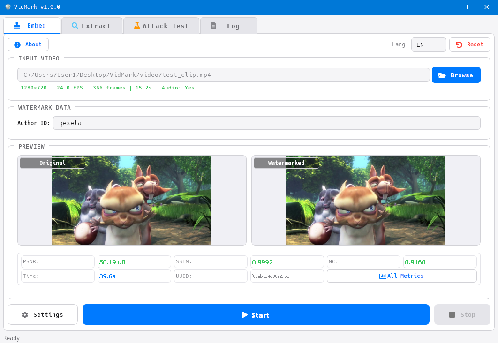
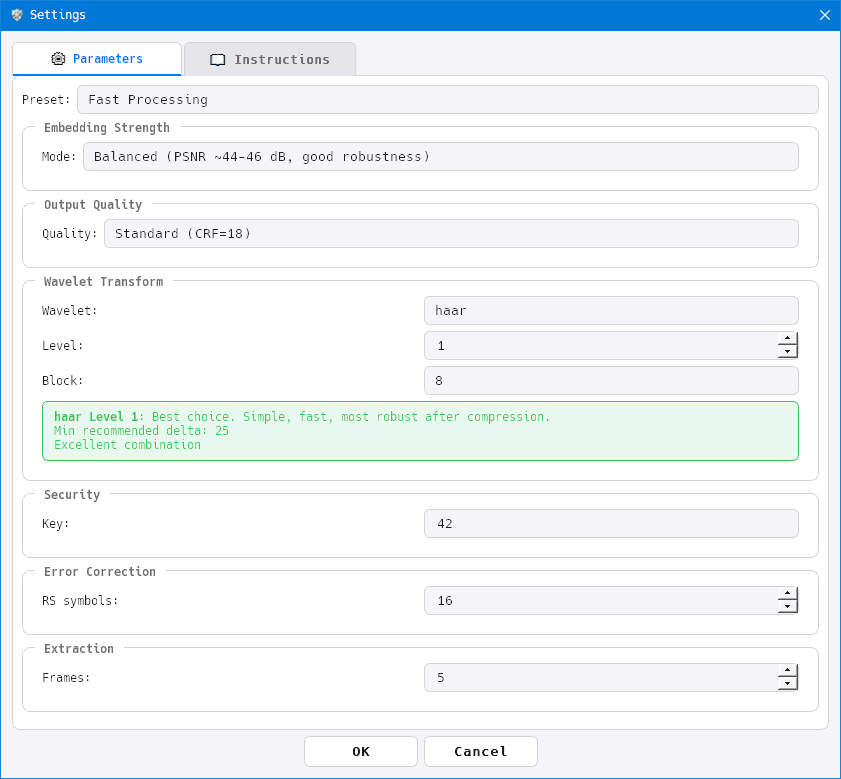
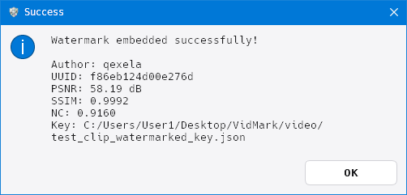
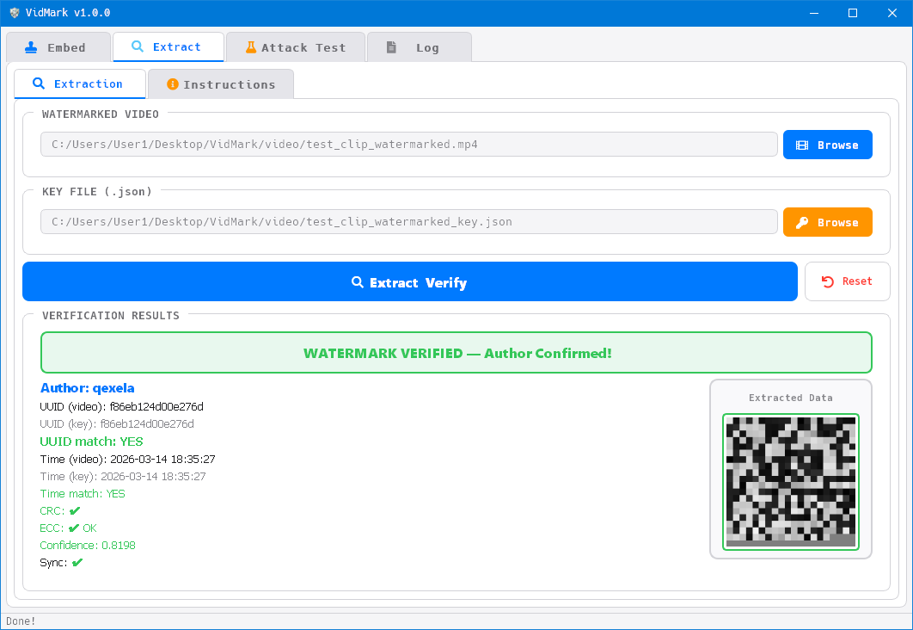
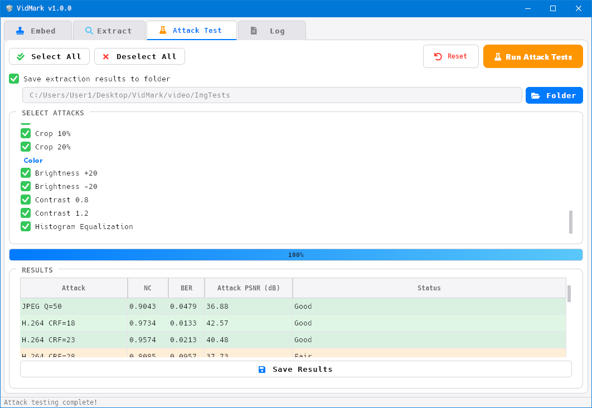
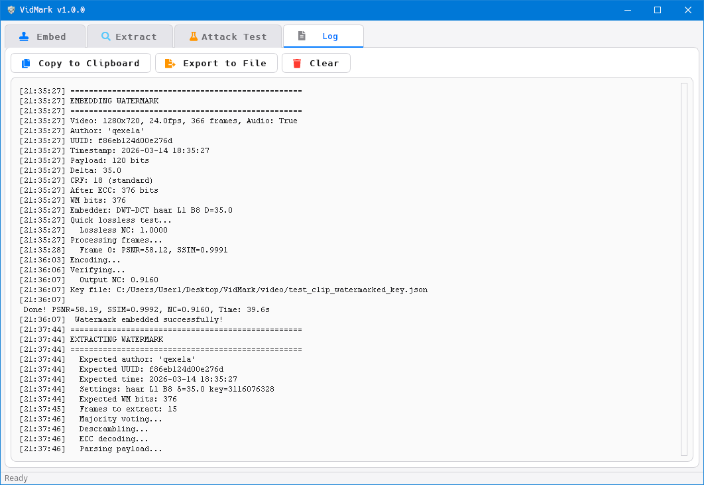
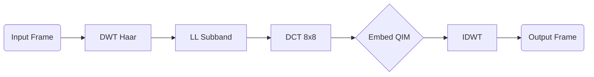

<div align="center">


# VidMark

> Digital video watermarking tool using DWT-DCT with QIM method.

<!-- Group 1: Links and Tech -->
[](https://github.com/qexela/VidMark/releases/latest)
[](LICENSE)
[](https://www.python.org/downloads/)
[](https://ffmpeg.org/download.html)

<!-- Language Switch -->
[](README.ru.md)

</div>

---

## 📋 Table of Contents

- [About](#-about)
- [Features](#-features)
- [Screenshots](#-screenshots)
- [Requirements](#-requirements)
- [Installation](#-installation)
- [Quick Start](#-quick-start)
- [Algorithm](#-algorithm)
- [Project Structure](#-project-structure)
- [Configuration](#-configuration)
- [Testing](#-testing)
- [Build EXE](#-build-exe)
- [Cleaning Scripts](#-cleaning-scripts)
- [FAQ](#-faq)
- [Contributing](#-contributing)
- [Acknowledgements](#-acknowledgements)

## 📖 About

**VidMark** is a desktop application for embedding digital watermarks into video files. It utilizes a combination of **Discrete Wavelet Transform (DWT)** and **Discrete Cosine Transform (DCT)** with **Quantization Index Modulation (QIM)** to hide digital signatures that are robust against compression, noise, and filtering.

This project was created as part of a university elective course.

## ✨ Features

### 🔒 Embedding
- **DWT-DCT-QIM** — Embedding in the frequency domain within the LL subband DCT coefficients.
- **Adjustable Intensity** — Presets: Invisible / Balanced / Robust, or manual delta input.
- **Unique Seed** — XOR of base seed + UUID + timestamp for enhanced security.
- **Automatic Key Generation** — A JSON key file is mandatory for extraction.

### 🔍 Extraction and Verification
- **Majority Voting** — Extraction from N uniformly selected frames.
- **Reed-Solomon Codes** — Data recovery from corrupted bits.
- **CRC-16 Verification** — Integrity validation after extraction.
- **SYNC Marker** — Confirmation of watermark presence before parsing.

### 🧪 Attack Resistance Testing
- **30+ Attack Types** — Compression, noise, filtering, geometry, color transformations.
- **H.264/H.265 Simulation** — Real encoding/decoding via FFmpeg.
- **NC/BER/PSNR Metrics** — Calculated for every attack.
- **CSV Export** — Save results for analysis.

### 📊 Quality Metrics
- **PSNR** — Peak Signal-to-Noise Ratio.
- **SSIM** — Structural Similarity Index.
- **NC** — Normalized Correlation.
- **BER** — Bit Error Rate.

### 🎨 Interface
- **macOS-style Light Theme** — Clean, modern QSS styling.
- **Real-time Preview** — Side-by-side comparison of original and watermarked frames.
- **Detailed Logging** — Operation log with timestamps and export capability.
- **Settings Dialog** — Wavelet/level/block/delta/CRF settings with compatibility tooltips.

## 📸 Screenshots

<details>
<summary><b>Click to expand gallery</b></summary>

<br>

<div align="center">

| 📥 Embedding | ⚙️ Settings |
|:---:|:---:|
|  |  |

| ✅ Verification | 📤 Extraction |
|:---:|:---:|
|  |  |

| 🧪 Attack Test | 📋 Log |
|:---:|:---:|
|  |  |

</div>

</details>

## 📋 Requirements

| Component   | Version       | Purpose                                                                                                           |
|:------------|:--------------|:------------------------------------------------------------------------------------------------------------------|
| Python      | 3.9+          | Runtime environment.                                                                                              |
| FFmpeg      | 4.4+          | Video encoding/decoding, audio copying, A/V tag normalization, compression attack simulation (H.264/H.265).       |
| ffprobe     | (w/ FFmpeg)   | Extracting video metadata (audio streams, format, duration).                                                      |
| ffplay      | (w/ FFmpeg)   | Video preview via ffplay (optional, right-click on preview).                                                      |

> ⚠️ **FFmpeg is mandatory.** VidMark requires **`ffmpeg`, `ffprobe`, and `ffplay`** in the system `PATH`. The application will show an error and exit if FFmpeg is not found.

**Installing FFmpeg:**

| Platform  | Command                                                                    |
|:----------|:---------------------------------------------------------------------------|
| Windows   | Download from [ffmpeg.org](https://ffmpeg.org/download.html), add to PATH. |
| macOS     | `brew install ffmpeg`                                                      |
| Ubuntu    | `sudo apt install ffmpeg`                                                  |
| Arch      | `sudo pacman -S ffmpeg`                                                    |

## 🚀 Installation

```bash
git clone https://github.com/qexela/VidMark.git
cd VidMark

python -m venv venv
source venv/bin/activate      # Linux/macOS
venv\Scripts\activate         # Windows

pip install -r requirements.txt
```

## ⚡ Quick Start

1.  **Launch:**
    ```bash
    ffmpeg -version # check ffmpeg installation
    python main.py
    ```
2.  **Embedding:** Go to "Embedding" tab → Select Video → Enter Text → "Start" → Choose save path.
    Wait for processing — metrics will appear on the preview panel.
3.  **Key:** ⚠️ **Save the `.json` key file!** Extraction is impossible without it.
4.  **Extraction:** Go to "Extraction" tab → Select Watermarked Video → Select Key File → "Extract & Verify".
    Result: ✅ CONFIRMED / ⚠️ MISMATCH / ❌ NOT FOUND.

## 🔬 Algorithm



The key file stores **exact embedding parameters**, including the scrambling seed. Without it, recovering the watermark is **impossible**.

## 📂 Project Structure

<details>
<summary>📂 <b>Expand file tree</b></summary>

```text
VidMark/
├── 🚀 main.py                     # Entry point
├── ⚙️ config.py                   # Global configuration
├── 🌐 i18n.py                     # Internationalization (EN/RU)
├── 📋 requirements.txt
├── 📖 README.md
├── 📖 README.ru.md
├── 📜 LICENSE                     # GPLv3
├── 🙈 .gitignore
│
├── 📁 core/                       # Watermarking algorithms
│   ├── 🔧 embedder.py             # DWT-DCT-QIM Embedding
│   ├── 🔍 extractor.py            # DWT-DCT-QIM Extraction
│   ├── 🛡️ ecc.py                  # Reed-Solomon codes
│   ├── 🔀 scrambler.py            # Bit scrambling
│   ├── 📦 payload.py              # Payload formation and parsing
│   ├── 📊 metrics.py              # PSNR, SSIM, NC, BER
│   ├── 🧪 attacks.py              # Attack simulator
│   └── 🔑 keyfile.py              # Key file management
│
├── 📁 ui/                         # PyQt5 Interface
│   ├── 🏠 main_window.py
│   ├── 📥 embed_tab.py
│   ├── 📤 extract_tab.py
│   ├── 🧪 attack_tab.py
│   ├── 📋 log_tab.py
│   └── ⚙️ settings_dialog.py
│
├── 📁 workers/                    # Background threads
│   └── 🔄 video_worker.py
│
├── 📁 utils/                      # Utilities
│   ├── 🎬 video_utils.py          # Video I/O, FFmpeg
│   └── 🖼️ image_utils.py          # Image conversion
│
├── 📁 assets/
│   ├── 🎨 icon.ico
│   └── 🎨 style.qss
│
├── 📁 scripts/
│   ├── 🔨 builder.py
│   └── 🧹 clean.bat / clean.sh / clean.ps1
│
├── 📁 tests/
│   └── 🧪 test_*.py (10 modules, 30+ tests)
│
└── 📁 screenshots/
```

</details>

## ⚙️ Configuration

### Intensity Presets

| Preset        | Delta  | PSNR (Typical) | Robustness   | Application                 |
|:--------------|:------:|:--------------:|:-------------|:----------------------------|
| Invisible     | 20.0   | > 48 dB        | Lower        | Proof of authorship         |
| **Balanced**  | 35.0   | ~44-46 dB      | Good         | General use (Default)       |
| Robust        | 55.0   | ~40-43 dB      | Maximum      | Aggressive conditions       |

### Wavelet Compatibility

| Wavelet  | Level 1        | Level 2         | Min. Delta  |
|:---------|:--------------:|:---------------:|:-----------:|
| **haar** | ✅ Excellent   | ⚠️ Questionable | 25+         |
| db2      | ✅ Excellent   | ⚠️ Questionable | 30+         |
| db4      | ⚠️ Questionable| ⚠️ Questionable | 40+         |
| bior4.4  | ⚠️ Questionable| ✅ Excellent    | 30+         |
| coif2    | ❌ Poor        | ❌ Poor         | 60+         |

## 🧪 Testing

```bash
pytest tests/ -v
python tests/test_cli.py
```

## 📦 Build EXE

```bash
python scripts/build.py              # Interactive menu
python scripts/build.py --build      # Direct build
python scripts/build.py --build --console  # With console window
```

## 🧹 Cleaning Scripts

Scripts to clean the repository from temporary files (caches, build artifacts, etc.).

```bash
./scripts/clean.sh          # Linux/macOS
scripts\clean.bat           # Windows CMD
scripts\clean.ps1           # Windows PowerShell
```

## ❓ FAQ

**Q: Why can't I extract the watermark?**
A: Incorrect key file, excessive compression (CRF > 28), or geometric distortions (rotation > 2 deg).

**Q: Can I embed a watermark into audio?**
A: No, VidMark works only with the video stream. Audio is copied unchanged.

**Q: What happens if I lose the key file?**
A: **The watermark cannot be recovered without the key.**

## 🤝 Contributing

This project was created as a university assignment and is open for educational contributions.

1.  Fork the repository
2.  Create a branch: `git checkout -b feature/improvement`
3.  Commit: `git commit -m 'Add improvement'`
4.  Push: `git push origin feature/improvement`
5.  Open a Pull Request

## 🙏 Acknowledgements

- [PyWavelets](https://pywavelets.readthedocs.io/) — Wavelet transforms
- [SciPy](https://scipy.org/) — DCT/IDCT
- [OpenCV](https://opencv.org/) — Video processing
- [FFmpeg](https://ffmpeg.org/) — Video encoding
- [reedsolo](https://github.com/tomerfiliba/reedsolomon) — Reed-Solomon codes
- [PyQt5](https://riverbankcomputing.com/software/pyqt/) — GUI framework (GPLv3 license)
- [QtAwesome](https://github.com/spyder-ide/qtawesome) — Icon fonts
- [Big Buck Bunny](https://peach.blender.org/) — Test video (CC BY 3.0)

---

<div align="center">

*Licensed under [GPLv3](LICENSE) • © 2026 qexela*

</div>