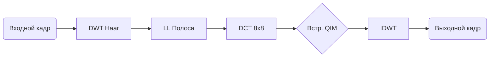

<div align="center">


# VidMark

> Инструмент встраивания ЦВЗ в видео методом DWT-DCT с QIM.

<!-- Группа 1: Ссылки и Технологии -->
[](https://github.com/AlexAgents/VidMark/releases/latest)
[](LICENSE)
[](https://www.python.org/downloads/)
[](https://ffmpeg.org/download.html)

<!-- Переключатель языка -->
[](README.md)

</div>

---

## 📋 Оглавление

- [О проекте](#-о-проекте)
- [Возможности](#-возможности)
- [Скриншоты](#-скриншоты)
- [Требования](#-требования)
- [Установка](#-установка)
- [Быстрый старт](#-быстрый-старт)
- [Алгоритм](#-алгоритм)
- [Структура проекта](#-структура-проекта)
- [Конфигурация](#-конфигурация)
- [Тестирование](#-тестирование)
- [Сборка EXE](#-сборка-exe)
- [Скрипты очистки](#-скрипты-очистки)
- [FAQ](#-faq)
- [Участие в проекте](#-участие-в-проекте)
- [Благодарности](#-благодарности)

## 📖 О проекте

**VidMark** — десктопное приложение для встраивания цифрового водяного знака в видеофайл. Используется комбинация **дискретного вейвлет-преобразования (DWT)** и **дискретного косинусного преобразования (DCT)** с **квантовой индексной модуляцией (QIM)** для скрытия цифровых подписей, устойчивых к сжатию, шуму и фильтрации.

Проект создан в рамках университетского факультатива.

## ✨ Возможности

### 🔒 Встраивание
- **DWT-DCT-QIM** — встраивание в частотной области в коэффициенты DCT подполосы LL
- **Настраиваемая интенсивность** — пресеты Невидимый / Баланс / Устойчивый или ручная дельта
- **Уникальный seed** — XOR базового seed + UUID + timestamp для безопасности
- **Автоматическая генерация ключа** — JSON-файл ключа обязателен для извлечения

### 🔍 Извлечение и проверка
- **Мажоритарное голосование** — извлечение из N равномерно выбранных кадров
- **Коды Рида-Соломона** — восстановление данных из повреждённых бит
- **Проверка CRC-16** — валидация целостности после извлечения
- **SYNC-маркер** — подтверждение наличия водяного знака перед парсингом

### 🧪 Тестирование устойчивости к атакам
- **30+ типов атак** — сжатие, шум, фильтрация, геометрия, цветовые преобразования
- **Симуляция H.264/H.265** — реальное кодирование/декодирование через FFmpeg
- **Метрики NC/BER/PSNR** — для каждой атаки
- **Экспорт в CSV** — сохранение результатов для анализа

### 📊 Метрики качества
- **PSNR** — пиковое отношение сигнал/шум
- **SSIM** — индекс структурного сходства
- **NC** — нормализованная корреляция
- **BER** — коэффициент битовых ошибок

### 🎨 Интерфейс
- **Светлая тема в стиле macOS** — чистый, современный QSS-стиль
- **Предпросмотр в реальном времени** — сравнение оригинала и водяного знака
- **Подробное журналирование** — журнал операций с временными метками и экспортом
- **Диалог настроек** — вейвлет/уровень/блок/дельта/CRF с подсказками совместимости

## 📸 Скриншоты

<details>
<summary><b>Нажмите, чтобы развернуть галерею</b></summary>

<br>

<div align="center">

| 📥 Встраивание | ⚙️ Настройки |
|:---:|:---:|
|  |  |

| ✅ Проверка | 📤 Извлечение |
|:---:|:---:|
|  |  |

| 🧪 Тест атак | 📋 Журнал |
|:---:|:---:|
|  |  |

</div>

</details>

## 📋 Требования

| Компонент   | Версия        | Назначение                                                                                                        |
|:------------|:--------------|:------------------------------------------------------------------------------------------------------------------|
| Python      | 3.9+          | Среда выполнения                                                                                                  |
| FFmpeg      | 4.4+          | Кодирование/декодирование видео, копирование аудио, нормализации меток A/V, симуляция атак сжатием (H.264/H.265)  |
| ffprobe     | (с FFmpeg)    | Извлечение метаданных видео (аудиопотоки, формат, длительность)                                                   |
| ffplay      | (с FFmpeg)    | Предпросмотр видео через ffplay (опционально, правый клик на превью)                                              |

> ⚠️ **FFmpeg обязателен.** VidMark требует **`ffmpeg`, `ffprobe` и `ffplay`** в системном `PATH`. Приложение покажет ошибку и завершится, если FFmpeg не найден.

**Установка FFmpeg:**

| Платформа | Команда                                                                   |
|:----------|:--------------------------------------------------------------------------|
| Windows   | Скачать с [ffmpeg.org](https://ffmpeg.org/download.html), добавить в PATH |
| macOS     | `brew install ffmpeg`                                                     |
| Ubuntu    | `sudo apt install ffmpeg`                                                 |
| Arch      | `sudo pacman -S ffmpeg`                                                   |

## 🚀 Установка

```bash
git clone https://github.com/AlexAgents/VidMark.git
cd VidMark

python -m venv venv
source venv/bin/activate      # Linux/macOS
venv\Scripts\activate         # Windows

pip install -r requirements.txt
```

## ⚡ Быстрый старт

1.  **Запуск:**
    ```bash
	ffmpeg -version # проверка ffmpeg
    python main.py
    ```
2.  **Встраивание:** Вкладка "Встраивание" → Выбрать видео → Ввести текст → "Старт" → Выбрать путь для сохранения.
Дождитесь обработки — метрики появятся на панели предпросмотра.
3.  **Ключ:** ⚠️ **Сохраните `.json` файл ключа!** Без него извлечение невозможно.
4.  **Извлечение:** Вкладка "Извлечение" → Выбрать видео с ЦВЗ → Выбрать файл ключа → "Извлечь и проверить".
Результат: ✅ ПОДТВЕРЖДЕНО / ⚠️ НЕСОВПАДЕНИЕ / ❌ НЕ НАЙДЕН.

## 🔬 Алгоритм



Файл ключа хранит **точные параметры встраивания**, включая seed скремблирования. Без него восстановить ЦВЗ **невозможно**.

## 📂 Структура проекта

<details>
<summary>📂 <b>Развернуть дерево файлов</b></summary>

```text
VidMark/
├── 🚀 main.py                     # Точка входа
├── ⚙️ config.py                   # Глобальная конфигурация
├── 🌐 i18n.py                     # Интернационализация (EN/RU)
├── 📋 requirements.txt
├── 📖 README.md
├── 📖 README.ru.md
├── 📜 LICENSE                     # GPLv3
├── 🙈 .gitignore
│
├── 📁 core/                       # Алгоритмы ЦВЗ
│   ├── 🔧 embedder.py             # Встраивание DWT-DCT-QIM
│   ├── 🔍 extractor.py            # Извлечение DWT-DCT-QIM
│   ├── 🛡️ ecc.py                  # Коды Рида-Соломона
│   ├── 🔀 scrambler.py            # Скремблирование бит
│   ├── 📦 payload.py              # Формирование и разбор полезной нагрузки
│   ├── 📊 metrics.py              # PSNR, SSIM, NC, BER
│   ├── 🧪 attacks.py              # Симулятор атак
│   └── 🔑 keyfile.py              # Управление ключевыми файлами
│
├── 📁 ui/                         # Интерфейс PyQt5
│   ├── 🏠 main_window.py
│   ├── 📥 embed_tab.py
│   ├── 📤 extract_tab.py
│   ├── 🧪 attack_tab.py
│   ├── 📋 log_tab.py
│   └── ⚙️ settings_dialog.py
│
├── 📁 workers/                    # Фоновые потоки
│   └── 🔄 video_worker.py
│
├── 📁 utils/                      # Утилиты
│   ├── 🎬 video_utils.py          # Видео I/O, FFmpeg
│   └── 🖼️ image_utils.py          # Конвертация изображений
│
├── 📁 assets/
│   ├── 🎨 icon.ico
│   └── 🎨 style.qss
│
├── 📁 scripts/
│   ├── 🔨 builder.py
│   └── 🧹 clean.bat / clean.sh / clean.ps1
│
├── 📁 tests/
│   └── 🧪 test_*.py (10 модулей, 30+ тестов)
│
└── 📁 screenshots/
```

</details>

## ⚙️ Конфигурация

### Пресеты интенсивности

| Пресет        | Дельта | PSNR (типично) | Устойчивость | Применение                 |
|:--------------|:------:|:--------------:|:-------------|:---------------------------|
| Невидимый     | 20.0   | > 48 дБ        | Ниже         | Доказательство авторства   |
| **Баланс**    | 35.0   | ~44-46 дБ      | Хорошая      | Общее (по умолчанию)       |
| Устойчивый    | 55.0   | ~40-43 дБ      | Максимальная | Агрессивные условия        |

### Совместимость вейвлетов

| Вейвлет  | Уровень 1      | Уровень 2       | Мин. дельта |
|:---------|:--------------:|:---------------:|:-----------:|
| **haar** | ✅ Отлично     | ⚠️ Сомнительно  | 25+         |
| db2      | ✅ Отлично     | ⚠️ Сомнительно  | 30+         |
| db4      | ⚠️ Сомнительно | ⚠️ Сомнительно  | 40+         |
| bior4.4  | ⚠️ Сомнительно | ✅ Отлично      | 30+         |
| coif2    | ❌ Плохо       | ❌ Плохо        | 60+         |

## 🧪 Тестирование

```bash
pytest tests/ -v
python tests/test_cli.py
```

## 📦 Сборка EXE

```bash
python scripts/build.py              # Интерактивное меню
python scripts/build.py --build      # Прямая сборка
python scripts/build.py --build --console  # С консолью
```

## 🧹 Скрипты очистки

Скрипты для очистки репозитория от временных файлов (кэши, артефакты сборки).

```bash
./scripts/clean.sh          # Linux/macOS
scripts\clean.bat           # Windows CMD
scripts\clean.ps1           # Windows PowerShell
```

## ❓ FAQ

**В: Почему не удается извлечь ЦВЗ?**
О: Неверный файл ключа, слишком сильное сжатие (CRF > 28) или геометрические искажения (поворот > 2 град).

**В: Можно ли встроить ЦВЗ в аудио?**
О: Нет, VidMark работает только с видеопотоком. Аудио копируется без изменений.

**В: Что если я потеряю файл ключа?**
О: **ЦВЗ восстановить без ключа невозможно.**

## 🤝 Участие в проекте

Проект создан как университетское задание и открыт для образовательных вкладов.

1. Форкните репозиторий
2. Создайте ветку: `git checkout -b feature/improvement`
3. Коммит: `git commit -m 'Добавлено улучшение'`
4. Пуш: `git push origin feature/improvement`
5. Откройте Pull Request

## 🙏 Благодарности

- [PyWavelets](https://pywavelets.readthedocs.io/) — вейвлет-преобразования
- [SciPy](https://scipy.org/) — DCT/IDCT
- [OpenCV](https://opencv.org/) — работа с видео
- [FFmpeg](https://ffmpeg.org/) — кодирование видео
- [reedsolo](https://github.com/tomerfiliba/reedsolomon) — коды Рида-Соломона
- [PyQt5](https://riverbankcomputing.com/software/pyqt/) — GUI-фреймворк (GPLv3 лицензия)
- [QtAwesome](https://github.com/spyder-ide/qtawesome) — шрифты иконок
- [Big Buck Bunny](https://peach.blender.org/) — тестовое видео (CC BY 3.0)

---

<div align="center">

*Licensed under [GPLv3](LICENSE) • © 2026 AlexAgents*

</div>